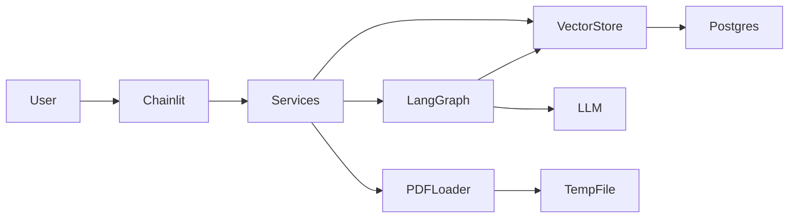

# DocTalk

Minimal PDF chat application: upload a PDF in Chainlit, ask questions, and get answers grounded in retrieved document chunks stored in Postgres with pgvector.

## Problem statement

Reviewers often need to ask questions against a PDF without reading the entire document. DocTalk provides a small but realistic vertical slice: ingest a PDF, index its text, and answer questions with source previews.

## Architecture



**Flow**

1. **Upload** — Chainlit receives a PDF, `services.ingest_pdf_file` writes it to a temp file, extracts text, chunks it, embeds chunks, stores metadata + vectors, then deletes the temp file.
2. **Chat** — User question enters a LangGraph workflow:
   - validate a document exists for the session
   - retrieve top-k chunks via cosine similarity
   - call an OpenAI-compatible LLM with retrieved context
   - return answer + chunk previews
3. **Storage** — One active document per Chainlit session. Re-upload replaces the previous document for that session.

## How to run

### Prerequisites

- Docker and Docker Compose
- An OpenAI-compatible API key

### Quick start

```bash
cp .env.example .env
# Edit .env and set OPENAI_API_KEY

docker compose up --build
```

Open [http://localhost:8000](http://localhost:8000), upload a text-based PDF, then ask questions.

### Local development (without Docker)

```bash
python -m venv .venv
source .venv/bin/activate
pip install -r requirements.txt

# Start Postgres with pgvector separately, then:
cp .env.example .env
export $(grep -v '^#' .env | xargs)

pytest
chainlit run app/main.py
```

## Environment variables

| Variable | Default | Description |
|----------|---------|-------------|
| `OPENAI_API_KEY` | — | Required API key |
| `OPENAI_BASE_URL` | — | Optional base URL for compatible providers |
| `LLM_MODEL` | `gpt-4o-mini` | Chat model |
| `EMBEDDING_MODEL` | `text-embedding-3-small` | Embedding model |
| `EMBEDDING_DIMENSIONS` | `1536` | Vector dimension (must match model) |
| `DATABASE_URL` | local Postgres URL | SQLAlchemy/psycopg connection string |
| `MAX_PDF_SIZE_MB` | `20` | Upload size limit |
| `CHUNK_SIZE` | `1000` | Characters per chunk |
| `CHUNK_OVERLAP` | `200` | Chunk overlap |
| `RETRIEVAL_TOP_K` | `4` | Chunks retrieved per question |

## What is implemented

- Chainlit UI with PDF upload and chat
- PDF text extraction with `pypdf`
- Recursive character chunking
- OpenAI-compatible embeddings + chat completions
- Postgres + pgvector storage with idempotent schema init
- LangGraph QA workflow with validation, retrieval, generation, and source previews
- Temp PDF cleanup after ingestion
- File size checks and user-facing error messages
- Docker Compose stack (app + Postgres)
- Fast unit tests with mocked LLM/embedding paths

## Intentionally skipped

- Authentication and multi-tenant isolation beyond Chainlit session IDs
- OCR for scanned/image PDFs
- Background workers and job queues
- Object storage (S3, etc.)
- Reranking, hybrid search, or agent tooling
- Production observability, rate limiting, and horizontal scaling

## Known limitations

- **Text-only PDFs** — scanned documents without a text layer will fail gracefully.
- **One document per session** — uploading again replaces the previous document.
- **Synchronous ingestion** — large PDFs block the request until indexing completes.
- **Session-scoped retrieval** — no cross-user document sharing.
- **Embedding dimension coupling** — changing embedding models requires matching `EMBEDDING_DIMENSIONS` and likely re-indexing.

## Production improvement plan

1. **Async ingestion** — queue PDF processing (Celery/RQ) and show progress in UI.
2. **Auth + tenancy** — user accounts, document ownership, and access control.
3. **Durable object storage** — optional raw PDF retention with lifecycle policies.
4. **Better retrieval** — reranking, metadata filters, hybrid BM25 + vector search.
5. **OCR pipeline** — handle scanned PDFs via Tesseract or a managed OCR service.
6. **Observability** — structured logging, tracing, metrics, and health endpoints.
7. **Migrations** — Alembic instead of idempotent `CREATE IF NOT EXISTS`.
8. **Testing** — integration tests against Testcontainers Postgres and contract tests for LLM providers.

## Project layout

```
app/
  main.py          # Chainlit handlers
  services.py      # Upload + chat orchestration
  graph.py         # LangGraph workflow
  pdf_loader.py    # Extraction + chunking
  vector_store.py  # Embeddings + retrieval
  db.py            # Connection + schema init
  config.py        # Environment config
  prompts.py       # Prompt templates
tests/
```

## Tests

```bash
pytest
```

Tests cover PDF failure handling, chunking, empty chunk rejection, temp-file cleanup, and graph behavior when no document is uploaded. LLM and embedding calls are mocked.
